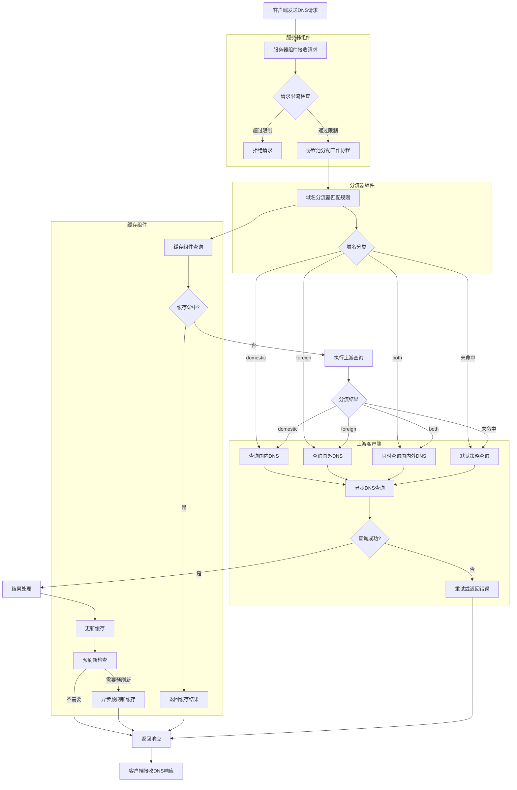

# PuraDNS

一个高性能的 DNS 代理服务器，具有智能分流、缓存优化和高并发处理能力。

## 项目概述

PuraDNS 是一个设计用于高性能 DNS 解析的代理服务器，其核心目标是在保证 DNS 解析准确性的同时，提供极致的性能和稳定的服务。通过智能分流、分片缓存和协程池等优化，PuraDNS 能够处理高并发请求，适用于个人和企业等不同场景。

### 测试环境域名规则数量

在测试环境中，PuraDNS 加载了 **152,918 个域名规则**，用于实现智能域名分流功能。

## 核心特性

- **智能域名分流**：基于 Trie 树的域名匹配算法，实现 O(m) 复杂度的高效域名分类
- **分片缓存系统**：256 个独立缓存分片，使用 fnv-1a 哈希分布，大幅降低锁竞争
- **协程池管理**：可配置的协程池限制并发数，防止资源耗尽
- **内存优化**：使用 sync.Pool 复用 DNS 消息和通道，减少 GC 压力
- **异步 DNS 查询**：非阻塞上游 DNS 解析，提高并发处理能力
- **请求限流**：令牌桶算法限制并发请求，保护系统稳定性
- **预刷新机制**：缓存到期前异步刷新，避免请求阻塞
- **多协议支持**：支持 plain DNS、DoT (DNS over TLS) 等协议

## 工作原理

PuraDNS 采用分层架构设计，主要由以下核心组件构成：

### 详细工作流程图



### 核心组件详解

1. **服务器组件 (Server)**
   - **请求接收**：监听 UDP/TCP 端口接收 DNS 请求
   - **请求限流**：通过令牌桶算法控制并发请求数，防止资源耗尽
   - **协程池调度**：将请求分配给协程池中的工作协程处理，优化资源使用
   - **响应处理**：统一处理上游返回结果，包括缓存更新和响应组装

2. **分流器组件 (Diverter)**
   - **Trie 树匹配**：使用 Trie 树结构存储 152,918 个域名规则，实现 O(m) 复杂度的高效匹配
   - **域名分类**：将域名分为 domestic（国内）、foreign（国外）或 both（双栈）
   - **分流决策**：根据分类结果决定使用哪个上游 DNS 服务器，提高解析准确性和速度

3. **缓存组件 (Cache)**
   - **分片设计**：256 个独立缓存分片，每个分片有自己的锁，大幅降低锁竞争
   - **高效哈希**：使用 fnv-1a 哈希算法分配键到不同分片，保证负载均衡
   - **异步预刷新**：缓存到期前 20% 时间异步刷新，避免请求阻塞
   - **灵活缓存策略**：支持自定义 TTL、最大内存限制等配置

4. **上游客户端 (Upstream Client)**
   - **异步查询**：非阻塞向上游 DNS 服务器发送查询，提高并发处理能力
   - **自动重试**：失败时自动尝试其他上游服务器，提高可用性
   - **多协议支持**：支持 plain DNS、DoT (DNS over TLS) 等协议
   - **连接池管理**：维护与上游服务器的连接池，提高查询效率

### 智能分流与缓存策略

| 分流策略 | 描述 |
|----------|------|
| domestic | 仅查询国内 DNS，不查询国外 |
| foreign  | 仅查询国外 DNS，不查询国内 |
| both     | 同时查询两个 DNS，优先返回更快的结果 |
| 未命中   | 直接向上游发起请求，并根据响应更新缓存 |

### 缓存预刷新机制

当缓存条目接近过期时间（默认剩余 20% TTL）时，PuraDNS 会自动触发异步预刷新机制：
1. 后台启动异步协程进行预刷新
2. 预刷新过程不阻塞正常请求
3. 预刷新失败时会重试（默认 3 次）
4. 预刷新结果更新到缓存中
5. 有效减少缓存失效时的请求延迟

## 安装方式

### 前置条件

- Go 1.20+ 环境
- Linux 操作系统（推荐 Debian/Ubuntu）

### 编译安装

1. 克隆仓库
   ```bash
   git clone https://github.com/hellobugworld/puradns.git
   cd puradns
   ```

2. 编译二进制文件
   ```bash
   make build
   ```

3. 安装服务
   ```bash
   make install
   ```

### 交叉编译

```bash
# 编译 ARM64 架构
make build-arm64

# 编译 ARMv7 架构
make build-armv7

# 编译所有 ARM 架构
make build-all-arm
```

## 配置说明

PuraDNS 的配置文件位于 `/etc/puradns/puradns.yaml`，主要包含以下配置项：

### 服务器配置

```yaml
listen_addr: "[::]:53"  # 监听地址和端口
```

### 资源文件配置

```yaml
resource:
  china_ip_path: "/etc/puradns/rules/china-ip.txt"
  china_list_path: "/etc/puradns/rules/chinalist.txt"
  gfw_list_path: "/etc/puradns/rules/gfwlist.txt"
  update_interval: 24h  # 定时更新规则文件的时间间隔
  urls:  # 规则文件的下载地址
    china_ip: "https://res.343.re/share/cleardns/china-ip.txt"
    china_list: "https://res.343.re/Share/cleardns/chinaglist.txt"
    gfw_list: "https://res.343.re/Share/cleardns/gfwlist.txt"
```

### 缓存配置

```yaml
cache:
  enabled: true
  capacity: 10000  # 缓存容量
  custom_ttl: 1h  # 可选，自定义TTL，优先级高于DNS响应中的TTL
  max_memory: 256MB
```

### 上游DNS配置

```yaml
upstream:
  # 引导DNS服务器，用于解析DOH/DOT服务器域名
  bootstrap_dns: ["223.5.5.5:53", "119.29.29.29:53", "2400:3200::1:53", "2400:3200:baba::1:53"]
  # 国内DNS服务器
  domestic:
    - addr: "223.5.5.5:53"
      protocol: "plain"
    - addr: "119.29.29.29:53"
      protocol: "plain"
  # 国外DNS服务器
  foreign:
    # Cloudflare DNS over TLS (IPv4)
    - addr: "1.1.1.1:853"
      protocol: "dot"
      tls_config:
        server_name: "dns.cloudflare.com"
```

## 使用方法

### 启动服务

```bash
# 使用 systemd 启动
systemctl start puradns

# 设置开机自启
systemctl enable puradns

# 查看服务状态
systemctl status puradns

# 查看日志
journalctl -u puradns -f
```

### 直接运行

```bash
# 使用默认配置文件
./puradns

# 指定配置文件
./puradns -config /path/to/puradns.yaml
```

### 测试DNS解析

```bash
# 使用dig测试
dig @127.0.0.1 www.google.com
dig @127.0.0.1 www.baidu.com

# 使用nslookup测试
nslookup www.google.com 127.0.0.1
nslookup www.baidu.com 127.0.0.1
```

## 性能测试结果

### 测试环境

| 项目 | 配置 |
|------|------|
| 测试类型 | 家用环境测试 |
| 路由器 | 华为 AX3PRO |
| 操作系统 | Debian 13 |
| CPU | AMD 415GA |
| 内存 | 8G DDR3 |
| 网络 | 四川联通 1000 兆 |

### 测试结果

| 并发线程数 | 总域名数 | 成功数 | 失败数 | 首次延迟 (ms) | 二次延迟 (ms) | 缓存命中率 | 加速比 |
|------------|----------|--------|--------|---------------|---------------|------------|--------|
| 100        | 4000     | 4000   | 0      | 263.32        | 25.89         | 93.27%     | 10.17x |
| 200        | 4000     | 4000   | 0      | 299.72        | 71.48         | 77.30%     | 4.19x  |
| 500        | 4000     | 4000   | 0      | 292.51        | 202.50        | 46.62%     | 1.44x  |
| 1000       | 4000     | 4000   | 0      | 320.16        | 214.40        | 46.50%     | 1.49x  |
| 4000       | 4000     | 4000   | 0      | 287.13        | 189.91        | 47.62%     | 1.51x  |

### 测试结果分析

- **稳定性优秀**：所有测试均保持 100% 成功率，无失败请求
- **高性能**：在 4000 并发线程下，首次延迟仅为 287.13 ms
- **高效缓存**：低并发下缓存命中率可达 93.27%，二次请求加速比最高可达 10.17x
- **良好的扩展性**：从 100 到 4000 线程，首次延迟仅增加 9.0%

## 卸载

```bash
make uninstall
```

## 潜在改进方向

1. **缓存预热机制**：提前加载常用域名的解析结果
2. **动态调整协程池大小**：根据系统负载动态调整协程池大小
3. **更细粒度的分流规则**：支持更复杂的域名匹配规则
4. **监控系统**：增加更详细的监控指标
5. **支持更多 DNS 协议**：如 DoH (DNS over HTTPS)

## 许可证

AGPLv3 License

## 贡献

欢迎提交 Issue 和 Pull Request！
