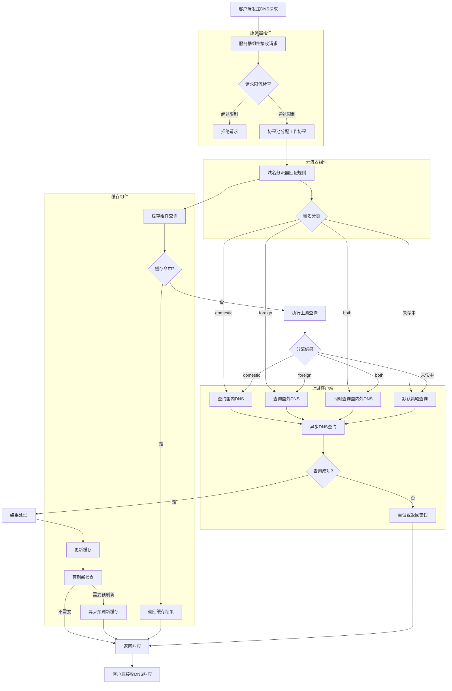

# PuraDNS

一个高性能的 DNS 代理服务器，具有智能分流、缓存优化和高并发处理能力。

## 项目概述

PuraDNS 是一个设计用于高性能 DNS 解析的代理服务器，其核心目标是在保证 DNS 解析准确性的同时，提供极致的性能和稳定的服务。通过智能分流、分片缓存和协程池等优化，PuraDNS 能够处理高并发请求，适用于个人和企业等不同场景。

### 测试环境域名规则数量

在测试环境中，PuraDNS 加载了 **152,918 个域名规则**，用于实现智能域名分流功能。

## 核心特性

- **智能域名分流**：基于 Trie 树的域名匹配算法，实现 O(m) 复杂度的高效域名分类
- **分片缓存系统**：256 个独立缓存分片，使用 fnv-1a 哈希分布，大幅降低锁竞争
- **协程池管理**：可配置的协程池限制并发数，防止资源耗尽
- **内存优化**：使用 sync.Pool 复用 DNS 消息和通道，减少 GC 压力
- **异步 DNS 查询**：非阻塞上游 DNS 解析，提高并发处理能力
- **请求限流**：令牌桶算法限制并发请求，保护系统稳定性
- **预刷新机制**：缓存到期前异步刷新，避免请求阻塞
- **多协议支持**：支持 plain DNS、DoT (DNS over TLS)、DoH (DNS over HTTPS) 等协议
- **HTTP/3 支持**：DoH 支持 HTTP/3，并自动回退到 HTTP/2/1.1，提高连接可靠性
- **灵活配置**：支持从配置文件读取所有参数，包括协程池大小、队列大小等
- **安全 TLS 配置**：支持完整的 TLS 配置，包括密码套件、版本控制和 SNI
- **自动重试机制**：查询失败时自动重试，提高可用性

## 工作原理

PuraDNS 采用分层架构设计，主要由以下核心组件构成：

### 详细工作流程图



### 核心组件详解

1. **服务器组件 (Server)**
   - **请求接收**：监听 UDP/TCP 端口接收 DNS 请求
   - **请求限流**：通过令牌桶算法控制并发请求数，防止资源耗尽
   - **协程池调度**：将请求分配给协程池中的工作协程处理，优化资源使用
   - **响应处理**：统一处理上游返回结果，包括缓存更新和响应组装

2. **分流器组件 (Diverter)**
   - **Trie 树匹配**：使用 Trie 树结构存储 152,918 个域名规则，实现 O(m) 复杂度的高效匹配
   - **域名分类**：将域名分为 domestic（国内）、foreign（国外）或 both（双栈）
   - **分流决策**：根据分类结果决定使用哪个上游 DNS 服务器，提高解析准确性和速度

3. **缓存组件 (Cache)**
   - **分片设计**：256 个独立缓存分片，每个分片有自己的锁，大幅降低锁竞争
   - **高效哈希**：使用 fnv-1a 哈希算法分配键到不同分片，保证负载均衡
   - **异步预刷新**：缓存到期前 20% 时间异步刷新，避免请求阻塞
   - **灵活缓存策略**：支持自定义 TTL、最大内存限制等配置

4. **上游客户端 (Upstream Client)**
   - **异步查询**：非阻塞向上游 DNS 服务器发送查询，提高并发处理能力
   - **自动重试**：失败时自动尝试其他上游服务器，提高可用性
   - **多协议支持**：支持 plain DNS、DoT (DNS over TLS) 等协议
   - **连接池管理**：维护与上游服务器的连接池，提高查询效率

### 智能分流与缓存策略

| 分流策略 | 描述 |
|----------|------|
| domestic | 仅查询国内 DNS，不查询国外 |
| foreign  | 仅查询国外 DNS，不查询国内 |
| both     | 同时查询两个 DNS，优先返回更快的结果 |
| 未命中   | 直接向上游发起请求，并根据响应更新缓存 |

### 缓存预刷新机制

当缓存条目接近过期时间（默认剩余 20% TTL）时，PuraDNS 会自动触发异步预刷新机制：
1. 后台启动异步协程进行预刷新
2. 预刷新过程不阻塞正常请求
3. 预刷新失败时会重试（默认 3 次）
4. 预刷新结果更新到缓存中
5. 有效减少缓存失效时的请求延迟

## 安装方式

### 前置条件

- Go 1.20+ 环境
- Linux 操作系统（推荐 Debian/Ubuntu）

### 编译安装

1. 克隆仓库
   ```bash
   git clone https://github.com/hellobugworld/puradns.git
   cd puradns
   ```

2. 编译二进制文件
   ```bash
   make build
   ```

3. 安装服务
   ```bash
   make install
   ```

### 交叉编译

```bash
# 编译 ARM64 架构
make build-arm64

# 编译 ARMv7 架构
make build-armv7

# 编译所有 ARM 架构
make build-all-arm
```

## 配置说明

PuraDNS 的配置文件位于 `/etc/puradns/puradns.yaml`，以下是完整的配置示例和说明：

### 完整配置示例

```yaml
# PuraDNS配置文件示例
# 这个文件包含了PuraDNS的所有配置选项，包括各种DNS协议支持

# 服务器配置
listen_addr: "127.0.0.1:53"  # 服务器监听地址，127.0.0.1:53表示只在本地监听
listen_addr_tcp: "127.0.0.1:53"  # TCP监听地址

# 资源文件配置
# 用来存储国内IP、国内域名和GFW域名列表的文件配置
resource:
  china_ip_path: "/etc/puradns/rules/china-ip.txt"  # 国内IP列表文件路径
  china_list_path: "/etc/puradns/rules/chinalist.txt"  # 国内域名列表文件路径
  gfw_list_path: "/etc/puradns/rules/gfwlist.txt"  # GFW域名列表文件路径
  update_interval: 24h  # 自动更新列表的间隔时间，24h表示每天更新一次
  urls:  # 下载列表文件的URL地址
    china_ip: "https://res.343.re/share/cleardns/china-ip.txt"
    china_list: "https://res.343.re/Share/cleardns/chinaglist.txt"
    gfw_list: "https://res.343.re/Share/cleardns/gfwlist.txt"
  download_timeout: 30s  # 下载列表文件的超时时间
  max_retries: 3  # 下载失败时的最大重试次数
  retry_delay: 5s  # 重试间隔时间

# 缓存配置
# 用来保存之前查询过的DNS结果，加快响应速度
cache:
  enabled: true  # 是否启用缓存（true表示启用）
  capacity: 20000  # 缓存最多能保存20000条DNS记录
  custom_ttl: 30m  # 缓存记录的过期时间，30m表示30分钟
  max_memory: 256MB  # 缓存最多使用256MB内存

# 预刷新配置
# 在DNS记录过期前自动刷新，避免用户请求时等待
pre_refresh:
  enabled: true  # 是否启用预刷新（true表示启用）
  threshold: 0.2  # 当记录剩余生命周期不足20%时开始刷新
  interval: 15m  # 检查需要刷新的记录的时间间隔
  max_concurrency: 10  # 同时最多刷新10条记录
  retry_count: 3  # 刷新失败时的重试次数

# 上游DNS配置
# 配置用来查询的上级DNS服务器
upstream:
  # 引导DNS服务器
  # 用来解析加密DNS服务器（DoT/DoH）的域名
  bootstrap: ["223.5.5.5:53", "119.29.29.29:53"]  # 使用国内公共DNS作为引导
  
  # 国内DNS服务器配置
  domestic:
    # 国内DNS - 使用加密的DoT协议
    - addr: "dns.alidns.com:853"
      protocol: "dot"  # dot表示DNS over TLS（加密）
      tls_config:
        server_name: "dns.alidns.com"  # 服务器名称，用于TLS验证
    
    # 国内DNS - 使用DoH协议（HTTP/2）
    - addr: "https://doh.pub/dns-query"
      protocol: "doh"  # doh表示DNS over HTTPS（加密）
      http3: false  # 不使用HTTP/3，只使用HTTP/2
      tls_config:
        server_name: "doh.pub"  # 服务器名称，用于TLS验证
    
    # 国内DNS - 使用DoH协议（支持HTTP/3）
    - addr: "https://dns.alidns.com/dns-query"
      protocol: "doh"  # doh表示DNS over HTTPS（加密）
      http3: true  # 优先使用HTTP/3，失败时自动回退到HTTP/2
      tls_config:
        server_name: "dns.alidns.com"  # 服务器名称，用于TLS验证
  
  # 国外DNS服务器配置
  foreign:
    # 国外DNS - 使用加密的DoT协议
    - addr: "8.8.8.8:853"
      protocol: "dot"  # dot表示DNS over TLS（加密）
      tls_config:
        server_name: "dns.google"  # 服务器名称，用于TLS验证
    
    # 国外DNS - 使用DoH协议（HTTP/2）
    - addr: "https://cloudflare-dns.com/dns-query"
      protocol: "doh"  # doh表示DNS over HTTPS（加密）
      http3: false  # 不使用HTTP/3，只使用HTTP/2
      tls_config:
        server_name: "cloudflare-dns.com"  # 服务器名称，用于TLS验证
    
    # 国外DNS - 使用DoH协议（支持HTTP/3）
    - addr: "https://dns.cloudflare.com/dns-query"
      protocol: "doh"  # doh表示DNS over HTTPS（加密）
      http3: true  # 优先使用HTTP/3，失败时自动回退到HTTP/2
      tls_config:
        server_name: "dns.cloudflare.com"  # 服务器名称，用于TLS验证
  
  # 查询超时时间
  query_timeout: 5s  # 向上游DNS查询的超时时间，5秒没响应就算失败
  # 健康检查间隔时间
  health_check: 1h  # 每隔1小时检查一次上游DNS服务器是否可用

# 安全配置
# 用来保护DNS服务器的安全设置
security:
  max_queries_per_second: 1000  # 每秒最多处理1000个查询，防止DNS洪水攻击
  max_response_size: 4096  # DNS响应的最大大小，防止过大的响应包
  enable_dnssec: true  # 是否启用DNSSEC验证（true表示启用，验证DNS记录的真实性）
  enable_query_logging: true  # 是否记录DNS查询日志（true表示记录）
  restricted_query_types: [255]  # 禁止查询ANY类型记录，255就是ANY类型的代码

# Goroutine池配置
# 用来控制DNS服务器同时处理多少请求，避免服务器因请求过多而崩溃
goroutinepool:
  size: 150        # 同时能处理请求的"工人"数量（最多150个请求同时处理）
  queue_size: 1500  # 当"工人"都在忙时，排队等待的请求数量（最多1500个请求排队）
```

### 配置选项说明

#### 服务器配置
- `listen_addr`: 服务器监听的UDP地址，格式为 `ip:port`
- `listen_addr_tcp`: 服务器监听的TCP地址，格式为 `ip:port`

#### 资源文件配置
- `china_ip_path`: 国内IP列表文件路径
- `china_list_path`: 国内域名列表文件路径
- `gfw_list_path`: GFW域名列表文件路径
- `update_interval`: 自动更新列表的间隔时间
- `urls`: 下载列表文件的URL地址
- `download_timeout`: 下载列表文件的超时时间
- `max_retries`: 下载失败时的最大重试次数
- `retry_delay`: 重试间隔时间

#### 缓存配置
- `enabled`: 是否启用缓存
- `capacity`: 缓存容量（最大记录数）
- `custom_ttl`: 缓存记录的过期时间
- `max_memory`: 缓存最大使用内存

#### 预刷新配置
- `enabled`: 是否启用预刷新
- `threshold`: 预刷新阈值（剩余生命周期比例）
- `interval`: 预刷新检查间隔
- `max_concurrency`: 预刷新最大并发数
- `retry_count`: 预刷新重试次数

#### 上游DNS配置
- `bootstrap`: 引导DNS服务器列表
- `domestic`: 国内DNS服务器配置列表
- `foreign`: 国外DNS服务器配置列表
- `query_timeout`: 上游查询超时时间
- `retry_count`: 上游查询重试次数
- `health_check`: 健康检查间隔

每个上游服务器支持以下协议：
- `plain`: 普通DNS（UDP/TCP）
- `dot`: DNS over TLS
- `doh`: DNS over HTTPS（支持HTTP/3回退）

**注意：** `tls_config` 是可选配置，当不需要自定义TLS设置时可以省略。PuraDNS会自动从URL中提取服务器名称作为默认的`server_name`。

#### 安全配置
- `max_queries_per_second`: 每秒最大查询数
- `max_response_size`: 最大响应大小
- `enable_dnssec`: 是否启用DNSSEC验证
- `enable_query_logging`: 是否启用查询日志
- `restricted_query_types`: 禁止的查询类型列表

#### Goroutine池配置
- `size`: 协程池大小（同时处理的请求数）
- `queue_size`: 队列大小（等待处理的请求数）

## 使用方法

### 启动服务

```bash
# 使用 systemd 启动
systemctl start puradns

# 设置开机自启
systemctl enable puradns

# 查看服务状态
systemctl status puradns

# 查看日志
journalctl -u puradns -f
```

### 直接运行

```bash
# 使用默认配置文件
./puradns

# 指定配置文件
./puradns -config /path/to/puradns.yaml
```

### 测试DNS解析

```bash
# 使用dig测试
dig @127.0.0.1 www.google.com
dig @127.0.0.1 www.baidu.com

# 使用nslookup测试
nslookup www.google.com 127.0.0.1
nslookup www.baidu.com 127.0.0.1
```

## 性能测试结果

### 测试环境

| 项目 | 配置 |
|------|------|
| 测试类型 | 家用环境测试 |
| 路由器 | 华为 AX3PRO |
| 操作系统 | Debian 13 |
| CPU | AMD 415GA |
| 内存 | 8G DDR3 |
| 网络 | 四川联通 1000 兆 |

### 测试结果

| 并发线程数 | 总域名数 | 成功数 | 失败数 | 首次延迟 (ms) | 二次延迟 (ms) | 缓存命中率 | 加速比 |
|------------|----------|--------|--------|---------------|---------------|------------|--------|
| 100        | 4000     | 4000   | 0      | 263.32        | 25.89         | 93.27%     | 10.17x |
| 200        | 4000     | 4000   | 0      | 299.72        | 71.48         | 77.30%     | 4.19x  |
| 500        | 4000     | 4000   | 0      | 292.51        | 202.50        | 46.62%     | 1.44x  |
| 1000       | 4000     | 4000   | 0      | 320.16        | 214.40        | 46.50%     | 1.49x  |
| 4000       | 4000     | 4000   | 0      | 287.13        | 189.91        | 47.62%     | 1.51x  |

### 测试结果分析

- **稳定性优秀**：所有测试均保持 100% 成功率，无失败请求
- **高性能**：在 4000 并发线程下，首次延迟仅为 287.13 ms
- **高效缓存**：低并发下缓存命中率可达 93.27%，二次请求加速比最高可达 10.17x
- **良好的扩展性**：从 100 到 4000 线程，首次延迟仅增加 9.0%

## 卸载

```bash
make uninstall
```

## 更新日志

详细的更新记录请查看 [CHANGELOG.md](CHANGELOG.md) 文件。

## 许可证

PuraDNS 采用 AGPLv3 许可证，详细信息请查看 [LICENSE](LICENSE) 文件。

## 贡献

欢迎提交 Issue 和 Pull Request！
